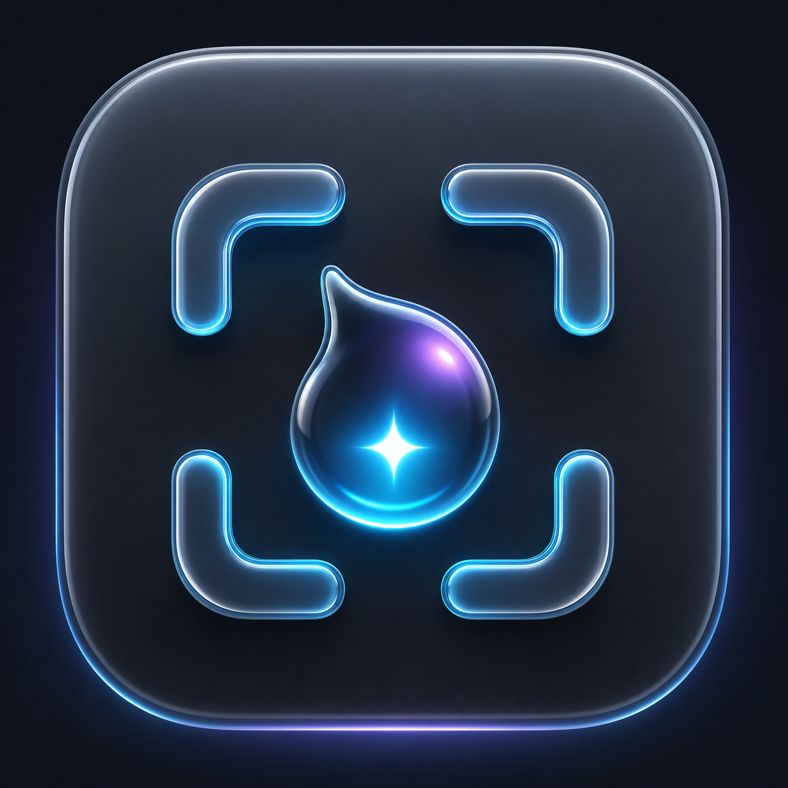
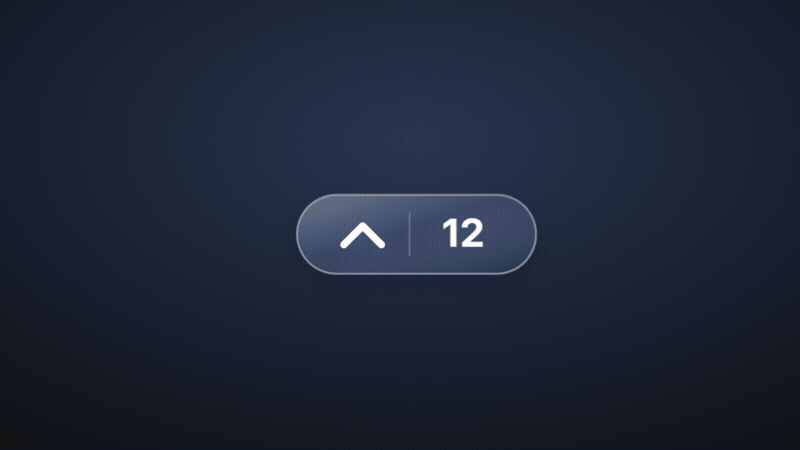
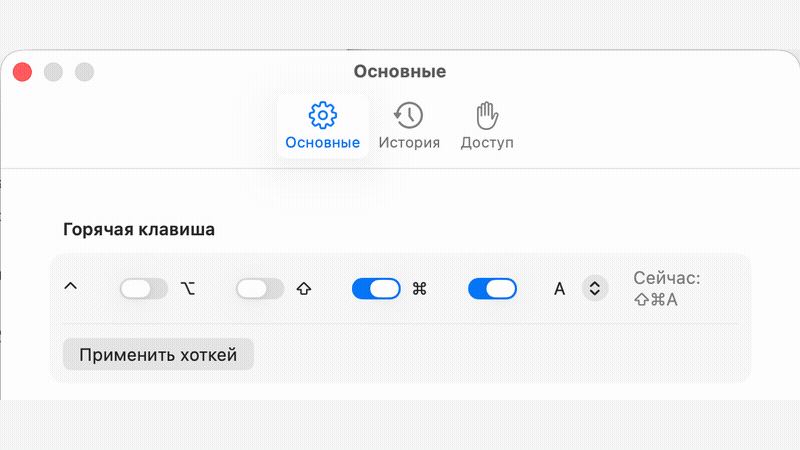
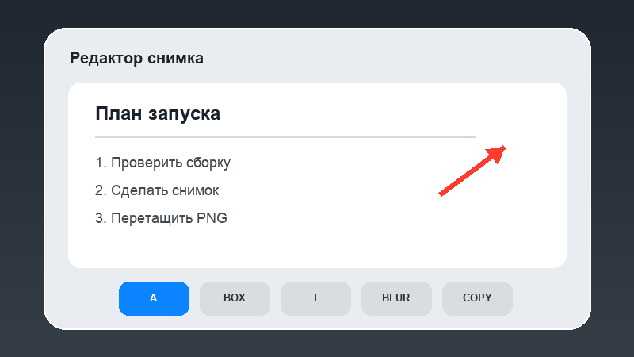
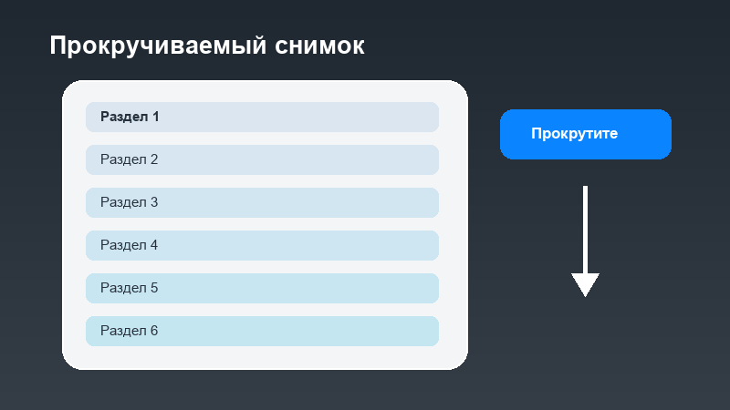

# Богдан Скриншот

<p align="center">
  
</p>

Нативный скриншотер для macOS на русском языке: быстрый захват, редактор, прокручиваемые снимки и полка последних 20 кадров. Без аккаунта, облака и отправки изображений на сервер.

[](https://github.com/bogdan0dzuba/screenshotapp-bogdan/releases/latest)
[](https://github.com/bogdan0dzuba/screenshotapp-bogdan/releases/latest)
[](https://github.com/bogdan0dzuba/screenshotapp-bogdan/releases/tag/v0.5.10)
[](https://github.com/bogdan0dzuba/screenshotapp-bogdan/releases/latest/download/ScreenshotApp-Bogdan-macOS-Universal.zip)

## Как это выглядит

### Полка последних снимков

Полка сворачивается в компактную стеклянную капсулу, остается поверх окон и хранит до 20 последних снимков. Любой прошлый кадр можно скопировать, сохранить, снова открыть в редакторе или перетащить в Finder, Telegram, браузер и Codex.



### Свой хоткей

Начальная комбинация - `⌘⇧A`. В настройках можно выбрать Command, Shift, Option, Control и любую английскую букву.



### Редактор сразу после снимка

После захвата редактор открывается автоматически. Доступны стрелки, фигуры, текст, счетчики, свободное рисование, маркер, блюр и пикселизация. Большой снимок можно приближать pinch-жестом и перемещать.



### Длинные страницы одним PNG

Нажмите заметную кнопку «Снимок с прокруткой» в нижней панели, выберите область, прокрутите страницу вручную и завершите захват. Перекрывающиеся кадры склеятся в один длинный снимок. У иконочных действий есть русские подсказки при наведении.



## Возможности

- нативный выбор области macOS по хоткею: системный прицел, координаты/размеры и отмена через Esc без предварительного снимка всего дисплея;
- сохранение наведенных значений, меню и подсказок при обычном выборе области;
- захват области, окна и всего экрана;
- прокручиваемый захват длинных страниц вверх и вниз с автоматической склейкой;
- автоматическое открытие редактора после снимка;
- живое превью рамки, стрелки, линии, карандаша, маркера, текста, блюра и пикселизации прямо во время протягивания мыши;
- стрелки, линии, рамки, овалы, карандаш, маркер, текст, счетчик, блюр и пикселизация;
- Undo/Redo, копирование, PNG/JPEG и системное «Сохранить как»;
- масштабирование pinch-жестом и прокрутка больших изображений;
- локальный OCR на русском и английском через Apple Vision;
- закрепление снимка поверх окон и настройка прозрачности;
- drag-and-drop отдельного PNG, а не всего окна приложения;
- локальная история до 20 снимков с редактируемыми слоями;
- понятные имена новых файлов по дате, времени и приложению, например `21 июля, 10.32 - Telegram.png`;
- переключатель «Автоматически удалять старые снимки»: при выключении история хранится без лимита количества и возраста;
- фоновые миниатюры истории без повторного декодирования полноразмерных PNG на главном потоке;
- перетаскиваемый разделитель между предпросмотром и историей; выбранная пропорция сохраняется;
- регулируемая прозрачность полки в стиле Liquid Glass;
- понятная история: дата без секунд, приложение и доступный заголовок окна сохраняются локально без Automation или Accessibility;
- папка снимков, которую легко передать локальному агенту;
- бесплатное автообновление через Sparkle: проверка, скачивание, криптографическая проверка и перезапуск;

## Совместимость

- macOS 14 Sonoma или новее;
- Apple Silicon: M1, M2, M3, M4 и следующие ARM-чипы;
- Intel Mac: `x86_64`;
- один Universal-архив содержит обе архитектуры.

## Скачать и установить

1. [Скачайте последнюю Universal-версию](https://github.com/bogdan0dzuba/screenshotapp-bogdan/releases/latest/download/ScreenshotApp-Bogdan-macOS-Universal.zip).
2. Распакуйте ZIP и перенесите `Богдан Скриншот.app` в папку «Программы».
3. При первом запуске нажмите правой кнопкой по приложению и выберите «Открыть».
4. Разрешите «Запись экрана», затем перезапустите приложение.

Путь к разрешению:

`Системные настройки -> Конфиденциальность и безопасность -> Запись экрана`

### Почему macOS показывает предупреждение

Открытая тестовая сборка имеет корректную ad-hoc подпись, но пока не подписана Apple Developer ID и не нотарифицирована. Поэтому Gatekeeper может потребовать первый запуск через правую кнопку -> «Открыть». Для обычного запуска по двойному клику без этого предупреждения нужен сертификат Apple Developer ID и нотарификация.

## Быстрый сценарий

1. Нажмите `⌘⇧A` и выделите область.
2. Отредактируйте снимок; редактор откроется автоматически.
3. Нажмите `⌘C` или `Ctrl+C`, либо перетащите PNG из полки в другое приложение.
4. Для длинной страницы нажмите «Снимок с прокруткой», выделите область, прокрутите страницу и нажмите «Готово».

## Где лежат снимки

Если существует `~/Documents/Codex`, приложение по умолчанию использует:

`~/Documents/Codex/Screenshots`

Иначе используется `~/Pictures/ScreenshotApp`. Папку можно поменять в настройках.

Для каждого снимка сохраняются:

- `*.source.png` - исходник;
- `*.png` - текущий итог для копирования и drag-and-drop;
- `*.project.json` - редактируемые слои и необязательная локальная подпись источника снимка.

Источник определяется по активному приложению и доступному macOS заголовку окна. Если содержимое открыто внутри временного окна ChatGPT Computer Use, приложение честно показывает `ChatGPT`, когда отдельное окно сайта недоступно системе.

## Автообновление

GitHub Actions проверяет проект и Universal-сборку при каждом обновлении `main`. Релиз публикуется одной командой `./script/publish_release.sh 0.5.10`: закрытый EdDSA-ключ берется из macOS Keychain, локально подписывает `appcast.xml` и никогда не передается GitHub. Приложение проверяет этот канал через Sparkle, скачивает архив из GitHub Releases, сверяет подпись и предлагает перезапуск. Автоматическая проверка и скачивание включены по умолчанию; их можно отключить в настройках.

Apple Developer Program для этого не требуется. Без Developer ID первая установка по-прежнему выполняется через правую кнопку -> «Открыть», а macOS может повторно запросить разрешение «Запись экрана» после крупных обновлений.

## Сборка из исходников

Обычная локальная сборка и запуск:

```bash
./script/build_and_run.sh --verify
```

Universal release для Apple Silicon и Intel:

```bash
./script/build_release.sh
```

Проверки:

```bash
swift run --disable-sandbox CoreChecks
bash Tests/CaptureMetadataChecks.sh
bash Tests/CapturePerformanceChecks.sh
bash Tests/HoverPreservationChecks.sh
bash Tests/ShelfPanelInteractionChecks.sh
bash Tests/EditorWindowInteractionChecks.sh
bash Tests/SettingsInteractionChecks.sh
bash Tests/LocalSigningIdentityChecks.sh
bash Tests/ReleasePackagingChecks.sh
bash Tests/RepositoryPublicationChecks.sh
bash Tests/UpdaterIntegrationChecks.sh
```

## Приватность

- снимки и OCR остаются на Mac;
- название приложения и доступный заголовок активного окна сохраняются только рядом со снимком, чтобы история была понятнее;
- облачная загрузка и аналитика отсутствуют;
- приложение обращается к GitHub для включенной пользователем проверки обновлений и при ручной команде «Проверить обновления…»;
- удаление истории перемещает собственные файлы приложения в Корзину.

Подробности: [PRIVACY.md](PRIVACY.md).

## Ограничения

- видео пока не записывается;
- при прокручиваемом захвате страницу прокручивает пользователь;
- для хорошей склейки соседние кадры должны заметно перекрываться;
- открытая тестовая версия еще не нотарифицирована Apple.
