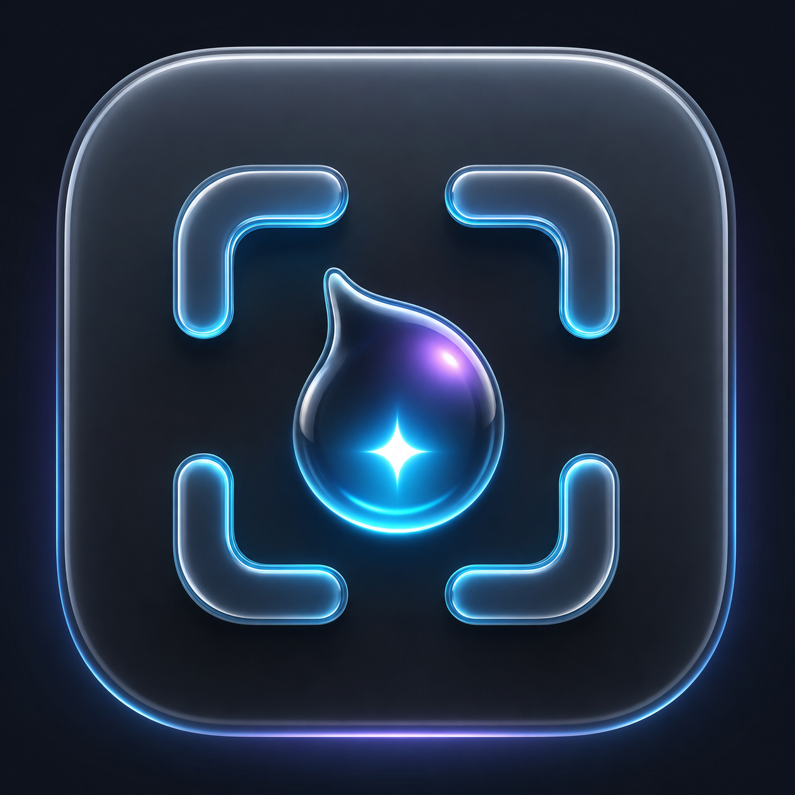
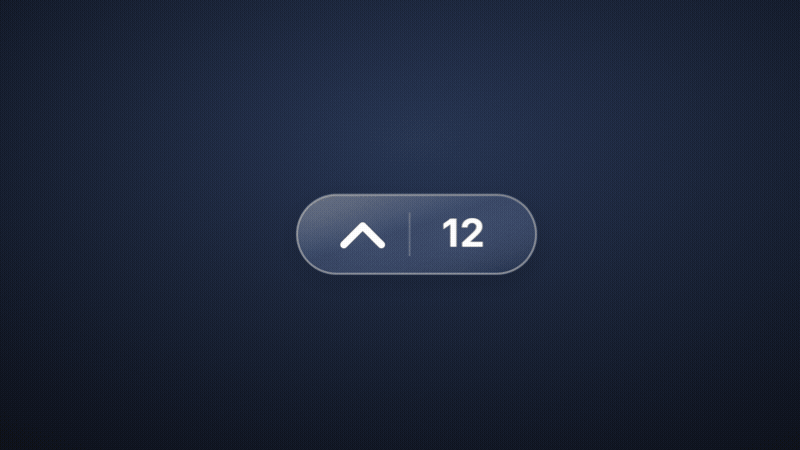
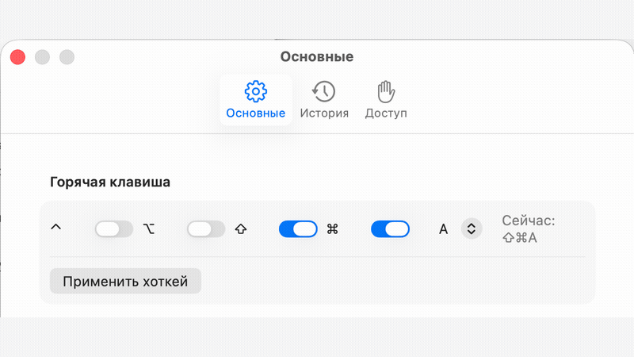
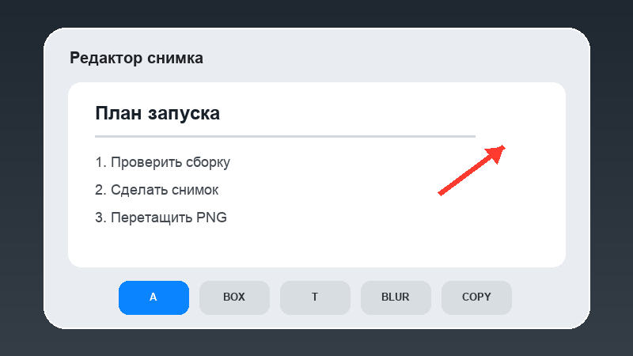
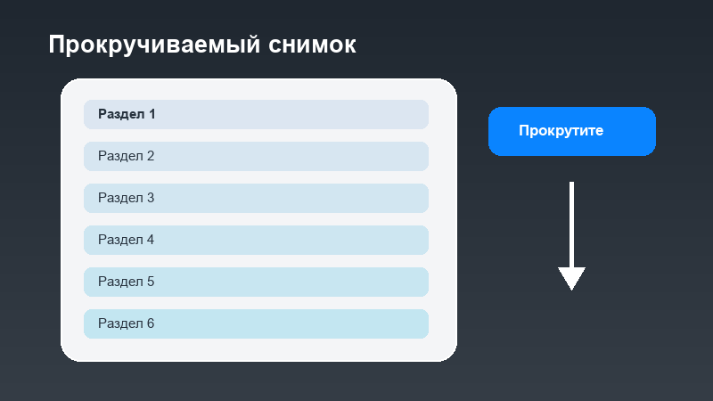

# Богдан Скриншот

<p align="center">
  
</p>

Нативный скриншотер для macOS на русском языке: быстрый захват, редактор, прокручиваемые снимки и полка последних 20 кадров. Без аккаунта, облака и отправки изображений на сервер.

[](https://github.com/bogdan0dzuba/screenshotapp-bogdan/releases/latest)
[](https://github.com/bogdan0dzuba/screenshotapp-bogdan/releases/latest)
[](https://github.com/bogdan0dzuba/screenshotapp-bogdan/releases/tag/v5.51)
[](https://github.com/bogdan0dzuba/screenshotapp-bogdan/releases/latest/download/ScreenshotApp-Bogdan-macOS-Universal.dmg)

## Исправление в 5.51

Перед выбором области, окна, всего экрана и прокруткой приложение проверяет разрешение «Запись экрана». При первом обращении без доступа запрашивает его у macOS. Если доступ не выдан или еще не применился, показывает объяснение и кнопку «Открыть настройки»; неполный снимок не открывается в редакторе. После включения доступа полностью завершите и снова запустите установленное приложение.

Резервный способ захвата также проверяет доступ. Проверены отказ, повторная попытка, выдача и отзыв разрешения, а также шесть путей сервиса с запрещенным доступом без изменения выходного файла.

## Что изменилось в 5.50

- Кеш превью ограничен 128 MiB, устаревшие редакции освобождаются.
- Сохранение повторно использует готовое изображение редактора; пустой документ не копирует все пиксели.
- При двойном сбое установки и отката резервная копия старой версии сохраняется.
- Включены накопленные улучшения захвата, прокрутки, редактора и перетаскивания снимков из истории.
- Проверены CoreChecks, 17 контрактных сценариев, стресс на 2000 изображениях, Universal DMG/ZIP и постоянная подпись.

Подробности и границы проверки: [отчет ревью 5.50](docs/reviews/2026-09-06-5.50-review.md). Физический Intel Mac, чистая установка у получателя и полный клиентский цикл Sparkle пока не проверены. Подпись локальная, без нотарификации Apple.

## Как это выглядит

### Полка последних снимков

Полка сворачивается в компактную стеклянную капсулу, остается поверх окон и хранит до 20 последних снимков. Любой прошлый кадр можно скопировать, сохранить, снова открыть в редакторе или перетащить в Finder, Telegram, браузер и Codex.



### Свой хоткей

Начальная комбинация - `⌘⇧A`. Полка и строка «Активная комбинация» всегда показывают именно зарегистрированный хоткей, а отдельная строка «Новая комбинация» - еще не примененный вариант. При конфликте прежний рабочий хоткей сохраняется; если сохраненное сочетание недоступно при запуске, приложение пробует стандартное `⌘⇧A`.



### Редактор сразу после снимка

После захвата редактор открывается автоматически. Доступны стрелки, фигуры, текст, счетчики, свободное рисование, маркер, блюр и пикселизация. Большой снимок можно приближать pinch-жестом и перемещать.



### Длинные страницы одним PNG

Нажмите заметную кнопку «Снимок с прокруткой» в нижней панели, выберите область и подтвердите её крупной кнопкой «Начать» в панели над рамкой. Рядом сразу видны «Отмена» и `Esc - отмена`. Затем прокручивайте страницу небольшими шагами в одном направлении и останавливайтесь примерно на 0,25 секунды. Сбоку от рамки появляется узкая панель, в которой растёт **настоящая склейка**: видно ровно то, что уйдёт в итоговый PNG, а не абстрактный объём прокрутки. За рамкой тонкий оранжевый след показывает уже принятые новые строки, чтобы было понятно, куда двигаться дальше. Под превью - подпись состояния: «Жду прокрутки», «Догоняю», «Кадр принят», «Верните перекрытие». Кнопка «Крутить само» отдаёт прокрутку приложению: оно двигает страницу шагом в треть области и останавливается, когда страница кончилась. Для неё нужен «Универсальный доступ»; при отказе остаётся обычная ручная прокрутка.



## Возможности

- быстрый выбор области по хоткею: прицел, размеры и надежная отмена через Esc с сохранением наведенных подсказок;
- сохранение наведенных значений, меню и подсказок при обычном выборе области;
- захват области, окна и всего экрана;
- прокручиваемый захват длинных страниц вверх и вниз с автоматической склейкой;
- автоматическое открытие редактора после снимка;
- живое превью рамки, стрелки, линии, карандаша, маркера, текста, блюра и пикселизации прямо во время протягивания мыши;
- стрелки, линии, рамки, овалы, карандаш, маркер, текст, счетчик, блюр и пикселизация;
- Undo/Redo, копирование, PNG/JPEG и системное «Сохранить как»;
- масштабирование pinch-жестом и прокрутка больших изображений;
- локальный OCR на русском и английском через Apple Vision;
- закрепление снимка поверх окон и настройка прозрачности;
- drag-and-drop отдельного PNG, а не всего окна приложения;
- локальная история до 20 снимков с редактируемыми слоями;
- понятные имена новых файлов по дате, времени и приложению, например `21 июля, 10.32 - Telegram.png`;
- переключатель «Автоматически удалять старые снимки»: при выключении история хранится без лимита количества и возраста;
- фоновые миниатюры истории без повторного декодирования полноразмерных PNG на главном потоке;
- перетаскиваемый разделитель между предпросмотром и историей; выбранная пропорция сохраняется;
- регулируемая прозрачность полки в стиле Liquid Glass;
- понятная история: дата без секунд, приложение и доступный заголовок окна сохраняются локально без Automation или Accessibility;
- папка снимков, которую легко передать локальному агенту;
- штатный автозапуск при входе в macOS, включаемый один раз по умолчанию и управляемый переключателем рядом с автообновлением;
- бесплатное автообновление через Sparkle: проверка, скачивание, криптографическая проверка и перезапуск;

## Совместимость

- macOS 14 Sonoma или новее;
- Apple Silicon: M1, M2, M3, M4 и следующие ARM-чипы;
- Intel Mac: `x86_64`;
- один Universal-архив содержит обе архитектуры.

## Скачать и установить

Перед обновлением завершите старую версию через меню приложения.

1. [Скачайте Universal DMG-установщик](https://github.com/bogdan0dzuba/screenshotapp-bogdan/releases/latest/download/ScreenshotApp-Bogdan-macOS-Universal.dmg).
2. Откройте DMG и запустите `Богдан Скриншот.app`. [ZIP-архив](https://github.com/bogdan0dzuba/screenshotapp-bogdan/releases/latest/download/ScreenshotApp-Bogdan-macOS-Universal.zip) оставлен для Sparkle и ручной установки.
3. Подтвердите установку в личную папку «Программы». При запуске из DMG снимите флажок «После установки удалить скачанную копию»: образ доступен только для чтения. Для распакованного ZIP этот флажок удаляет исходную копию после успешного запуска установленной версии.
4. Если macOS блокирует первый запуск, разрешите открытие этого приложения в «Системные настройки» -> «Конфиденциальность и безопасность». [Инструкция Apple](https://support.apple.com/ru-ru/102445).
5. Разрешите «Запись экрана», затем перезапустите приложение.

Путь к разрешению:

`Системные настройки -> Конфиденциальность и безопасность -> Запись экрана`

### Почему macOS показывает предупреждение

Открытая тестовая сборка подписана одной постоянной локальной подписью, но пока не подписана Apple Developer ID и не нотарифицирована. Поэтому Gatekeeper может потребовать первый запуск через правую кнопку -> «Открыть». Для обычного запуска по двойному клику без этого предупреждения нужен сертификат Apple Developer ID и нотарификация.

Apple Developer Program для личного использования и установки у друзей оплачивать не обязательно. Платная учетная запись нужна только для распространения без предупреждения Gatekeeper: сертификата `Developer ID Application` и нотарификации Apple. Само приложение, автозапуск и обновления через Sparkle работают без нее.

## Быстрый сценарий

1. Нажмите `⌘⇧A` и выделите область.
2. Отредактируйте снимок; редактор откроется автоматически.
3. Нажмите `⌘C` или `Ctrl+C`, либо перетащите PNG из полки в другое приложение.
4. Для длинной страницы нажмите «Снимок с прокруткой», выделите область и нажмите «Начать» в панели над рамкой. Дальше либо нажмите «Крутить само», либо прокручивайте вручную примерно на треть области в одном направлении, останавливаясь примерно на 0,25 секунды. Панель сбоку показывает растущую склейку и состояние; за рамкой появляется только тонкий оранжевый след без копии страницы, поэтому содержимое остаётся читаемым. Панель с крупными командами и подсказкой `Esc - отмена` не исчезает при возврате в браузер.

## Где лежат снимки

Если существует `~/Documents/Codex`, приложение по умолчанию использует:

`~/Documents/Codex/Screenshots`

Иначе используется `~/Pictures/ScreenshotApp`. Папку можно поменять в настройках.

Для каждого снимка сохраняются:

- `*.source.png` - исходник;
- `*.png` - текущий итог для копирования и drag-and-drop;
- `*.project.json` - редактируемые слои и необязательная локальная подпись источника снимка.

Источник определяется по активному приложению и доступному macOS заголовку окна. Если содержимое открыто внутри временного окна ChatGPT Computer Use, приложение честно показывает `ChatGPT`, когда отдельное окно сайта недоступно системе.

## Автообновление

GitHub Actions проверяет проект и Universal-сборку при каждом обновлении `main`. Релиз публикуется одной командой `./script/publish_release.sh 0.5.25`: закрытый EdDSA-ключ берется из macOS Keychain, локально подписывает `appcast.xml` и никогда не передается GitHub. Номер сборки берется из `script/version.sh` и перед упаковкой сравнивается с последним публичным `sparkle:version`; равный или меньший номер останавливает публикацию. Приложение проверяет этот канал через Sparkle при каждом запуске и затем раз в сутки. Обычное обновление автоматически загружается, проверяется, устанавливается и перезапускает приложение; ручная проверка остается в настройках.

Apple Developer Program для этого не требуется. Без Developer ID первая установка по-прежнему выполняется через правую кнопку -> «Открыть». При переходе со старой ad-hoc версии macOS может один раз повторно запросить «Запись экрана»; следующие выпуски используют ту же подпись и не должны сбрасывать это разрешение.

### Что проверено при выпуске 0.5.25

- локальная сборка и автоматические проверки исходников;
- Universal-сборка `arm64 + x86_64`, ZIP, DMG, подпись приложения и контрольные суммы;
- конфигурация Sparkle, EdDSA-проверка архива и защита от повторного номера сборки;
- регистрация автозапуска через `SMAppService`, сохранение включенного состояния после перезапуска приложения;
- удаление одобренной скачанной копии после запуска установленного приложения.
- GitHub Actions для релизного коммита и публичный GitHub Release с подписанным `appcast.xml`.

После публикации остаются два ручных сценария приемки:

1. Перезагрузить Mac и убедиться, что приложение запустилось само.
2. На копии публичной `0.5.17` нажать «Проверить обновления…», установить `0.5.25` и убедиться, что приложение перезапустилось с версией `0.5.25 (39)`.

Пока эти два сценария не пройдены на реальной машине, нельзя утверждать, что автозапуск после перезагрузки и полный клиентский цикл обновления подтверждены. Автоматические контрактные проверки подтверждают реализацию, но не заменяют эту приемку.

## Сборка из исходников

Обычная локальная сборка и запуск:

```bash
./script/build_and_run.sh --verify
```

Universal release для Apple Silicon и Intel:

```bash
./script/build_release.sh
```

Проверки:

```bash
swift run --disable-sandbox CoreChecks
bash Tests/CaptureMetadataChecks.sh
bash Tests/CapturePerformanceChecks.sh
bash Tests/HistoryDeletionChecks.sh
bash Tests/KeyActionLatencyChecks.sh
bash Tests/HoverPreservationChecks.sh
bash Tests/CaptureCancellationChecks.sh
bash Tests/ScrollCaptureInteractionChecks.sh
bash Tests/ShelfPanelInteractionChecks.sh
bash Tests/EditorWindowInteractionChecks.sh
bash Tests/SettingsInteractionChecks.sh
bash Tests/SettingsWindowChecks.sh
bash Tests/LocalSigningIdentityChecks.sh
bash Tests/ReleasePackagingChecks.sh
bash Tests/RepositoryPublicationChecks.sh
bash Tests/UpdaterIntegrationChecks.sh
bash Tests/ReleaseBuildNumberChecks.sh
```

Нагрузочная проверка кеша и рендера (синтетические изображения, без захвата личного экрана):

```bash
swift run --disable-sandbox --configuration release CoreChecks --stress
```

Установщик 5.50 в отдельную папку:

```bash
SCREENSHOT_APP_DIST_DIR="$PWD/dist/5.50" ./script/build_release.sh
```

## Приватность

- снимки и OCR остаются на Mac;
- название приложения и доступный заголовок активного окна сохраняются только рядом со снимком, чтобы история была понятнее;
- облачная загрузка и аналитика отсутствуют;
- приложение обращается к GitHub для включенной пользователем проверки обновлений и при ручной команде «Проверить обновления…»;
- удаление истории сразу удаляет только собственные файлы приложения.

Подробности: [PRIVACY.md](PRIVACY.md).

## Ограничения

- видео пока не записывается;
- при прокручиваемом захвате страницу прокручивает пользователь;
- для хорошей склейки соседние кадры должны заметно перекрываться;
- открытая тестовая версия еще не нотарифицирована Apple.
